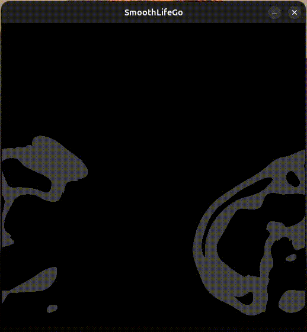

# SmoothLifeGo
 
A Golang port of duckythescientist's (Python) implementation of SmoothLife https://github.com/duckythescientist/SmoothLife - a continuous domain generalisation of Conway's Game of Life. You can read the original paper on which this is based here: https://arxiv.org/abs/1111.1567

This particular port lacks the vivid colors of original, and I would highly recommend looking at duckythescientist's original Python implementation if you are interested.

The result of this implementation gives a cell-like simulation as you can see in the sample below:

